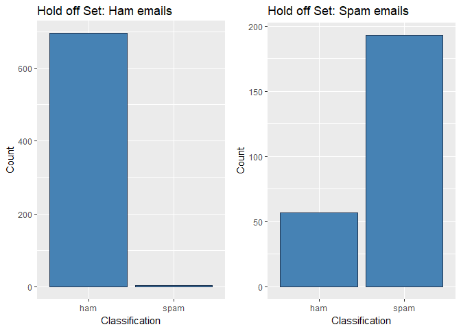
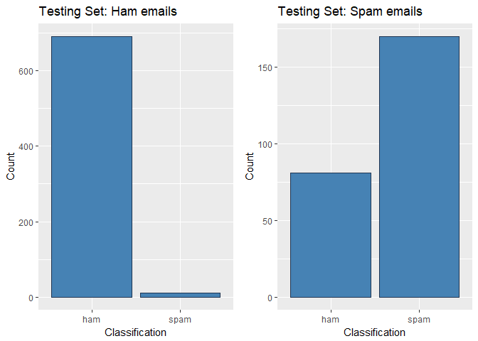
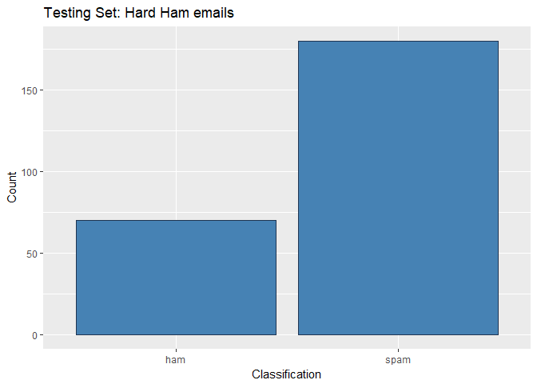

------

### Spam-Ham Classification

This project uses *Naive Bayes* to classify plain text documents as either `spam` or `ham`. This work is based on what I learned from a YouTube lecture by UC Berkeley Prof. Pieter Abbeel on Machine Learning: Naive Bayes (https://www.youtube.com/watch?v=DNvwfNEiKvw).

The `tm` library is used to process the corpus. 

Three sets of data that were used. The `training set` was used to train the classification method. The `hold off` set was used to test the classification with different parameters to try and improve the accuracy of the classification. Finally, the `testing` set was used to test the classification once the parameters are set for the classification. 

Source of data: 
http://spamassassin.apache.org/old/publiccorpus/


<b>Training set</b>: 

* *easy* ham: filename *20021010_easy_ham.tar.bz2* (qty: 2551)
* spam: filename *20050311_spam_2.tar.bz2* (qyt: 1396)

<b>Hold off set</b>: 

* *easy* ham: filename *20030228_easy_ham_2.tar.bz2* (qty: subset of 700)
* spam: filename *20030228_spam.tar.bz2* (qty: subset of 250)

<b>Testing set</b>: 

* *easy* ham: filename *20030228_easy_ham_2.tar.bz2* (qty: subset of 701)
* *hard* ham: filename *20021010_hard_ham.tar.bz2* (qty: 250)
* spam: filename *20030228_spam.tar.bz2* (qty: subset of 251)


--------------


### Libraries


```r
library(tm)
library(dplyr)
library(ggplot2)
library(SnowballC)
library(knitr)
library(stringr)
library(DT)
```

-----

### Load `spam` and `ham` corpus

The `tm` library is used to load the files.

The code below loads the spam-ham `training` set, `hold off` set, and `testing` set.


```r
#SETS
ham_training_folder <- "./spamham/easy_ham_training_p1"
spam_training_folder <- "./spamham/spam_2_training_p2"
ham_testing_folder <- "./spamham/easy_ham_2_TESTING"
spam_testing_folder <- "./spamham/spam_TESTING"
ham_holdoff_folder <- "./spamham/easy_ham_2_HOLDOFF"
spam_holdoff_folder <- "./spamham/spam_HOLDOFF"
hard_ham_testing_folder <- "./spamham/hard_ham_TESTING"

#LOAD FILES
ham_training <- VCorpus(DirSource(ham_training_folder))  
spam_training <- VCorpus(DirSource(spam_training_folder))  
ham_testing <- VCorpus(DirSource(ham_testing_folder))  
spam_testing <- VCorpus(DirSource(spam_testing_folder))  
ham_holdoff <- VCorpus(DirSource(ham_holdoff_folder))
spam_holdoff <- VCorpus(DirSource(spam_holdoff_folder))
hard_ham_testing <- VCorpus(DirSource(hard_ham_testing_folder))

#summary(ham_training) 
#summary(spam_training)
```
-----

### Size of each file

This table lists the number of emails in the `ham` and `spam` files in each set. 


|File                   |No. of Emails |
|:----------------------|:-------------|
|Training Set: Easy Ham |2551          |
|Traning Set: Spam      |1396          |
|Hold Off Set: Easy Ham |700           |
|Hold Off Set: Spam     |250           |
|Testing Set: Easy Ham  |701           |
|Testing Set: Spam      |251           |
|Testing Set: Hard Ham  |250           |

-----

### Data preprocessing 

This simplistic approach in text classification only focuses on the English alpha characters and the case of the alpha characters is ignored. Text is converted to lowercase. Punctuations are also removed before the term document matrix and document term matrix are generated. 

Other possible features that may play a role in improving the accuracy of the classification are not considered such as whether the message is formatted in html or not, if mispelled words are present, or if the message has words spelled in all uppercase characters among other things.

Removing English stop words decreased the observed accuracy of the classification based on the `training` set. In addition, stemming the words also decreased the observed accuracy of the classification based on the `training` set.

Below is observed classification on the `hold off` set. 

No removal of stop words or stemming used ( k= 0.5)

* ham:  696 ham / 4 spam
* spam: 57 ham / 193 spam 

Remove stop words (k = 0.5)

* ham:  693 ham / 7 spam
* spam: 67 ham / 183 spam

Stemming of words used (k = 0.5)

* ham:  696 ham / 4 spam
* spam: 61 ham / 189 spam

-----

### Convert to lowercase

Characters in plain text documents are converted to lowercase. 

```r
convert.lowercase <- function(doc){
  doc <- tm_map(doc, tolower)   
  doc <- tm_map(doc, PlainTextDocument)
  return(doc)
}
#TRAINING SET
ham_training <- convert.lowercase(ham_training)  
spam_training <- convert.lowercase(spam_training) 

#TESTING SET
ham_testing <- convert.lowercase(ham_testing)
hard_ham_testing <- convert.lowercase(hard_ham_testing)
spam_testing <- convert.lowercase(spam_testing)   

#HOLD OFF SET
ham_holdoff <- convert.lowercase(ham_holdoff)
spam_holdoff <- convert.lowercase(spam_holdoff)   

#inspect(ham_training[[1]])
```

-----

### Extract alpha characters only

This simplistic approach in text classification only looks at alpha characters. 


```r
extract.alpha <- function(docs){
  thispattern = "[a-z]+ |[a-z]+[a-z]$|[a-z]+[\\.|,|;] "
  for (j in seq(docs))
  {
    letters_only <- unlist(str_extract_all(docs[[j]], thispattern))
    docs[[j]] <- paste(letters_only, collapse = "   ")
  }
  #docs <- tm_map(docs, removeWords, stopwords("english"))
  #docs <- tm_map(docs, stemDocument, language = "english")  
  docs <- tm_map(docs, stripWhitespace)
  docs <- tm_map(docs, PlainTextDocument)
  docs <- tm_map(docs, removePunctuation)
  
  #inspect(docs[[1]])
  return(docs)
}
#TRAINING
ham_training <- extract.alpha(ham_training)
spam_training <- extract.alpha(spam_training)

#TESTING
ham_testing <- extract.alpha(ham_testing)
spam_testing <- extract.alpha(spam_testing)
hard_ham_testing <- extract.alpha((hard_ham_testing))

#HOLDOFF
ham_holdoff <- extract.alpha(ham_holdoff)
spam_holdoff <- extract.alpha(spam_holdoff)

#inspect(ham_training[[1]])
#inspect(spam_training[[1]])
#inspect(ham_testing[[1]])
#inspect(hard_ham_testing[[1]])
#inspect(spam_testing[[1]])
#inspect(ham_holdoff[[1]])
#inspect(spam_holdoff[[1]])
```

-----

### Create a term document matrix

This is the `training` set term document matrix. 

This is going to be used to generate the `training` set term frequency list. 

```r
ham_tdm <- TermDocumentMatrix(ham_training)
spam_tdm <- TermDocumentMatrix(spam_training)
```

-----

### Create the term frequency list

This is the term frequency list for the `training` set. 

Classification is going to depend on the term frequency list for `ham` and `spam` in the `training` set. 


```r
ham_freq <- rowSums(as.matrix(ham_tdm))
spam_freq <- rowSums(as.matrix(spam_tdm))

ham_termFreq <- cbind(names(ham_freq),ham_freq)
spam_termFreq <- cbind(names(spam_freq), spam_freq)

rownames(ham_termFreq) <- NULL
rownames(spam_termFreq) <- NULL

colnames(ham_termFreq) <- c("term", "frequency")
colnames(spam_termFreq) <- c("term", "frequency")

ham_termFreq <- data.frame(ham_termFreq, stringsAsFactors = FALSE)
spam_termFreq <- data.frame(spam_termFreq, stringsAsFactors = FALSE)

ham_termFreq$frequency <- as.numeric(ham_termFreq$frequency)
spam_termFreq$frequency <- as.numeric(spam_termFreq$frequency)

#head(ham_termFreq,10)
#head(spam_termFreq,10)
```

-----

### Calculate probability for each term in `training` set term frequency list

To calculate the conditional probability of the terms, *Laplace smoothing* was used. The value for `k` used is `0.5`. For the `training` set, k values of 0.1, 0.5, 1.5, and 2 were investigated. The classification was better (particularly for spam) when `k = 0.5`. 


`ham.UNKNOWN` and `spam.UNKNOWN` are conditional probabilities used when the term is <b>not found</b> in the training set. 

The marginal probability for `ham` and `spam` are based on the proportion of `ham` emails and `spam` emails in the entire training set. 


```r
ham_prob <- length(ham_training)/ (length(ham_training) + length(spam_training))
spam_prob <-  length(spam_training)/ (length(ham_training) + length(spam_training))

#Ham and spam marginal probability
ham_prob
```

```
## [1] 0.6463137
```

```r
spam_prob
```

```
## [1] 0.3536863
```

```r
#Laplace smoothing
k <- 0.5

#Total count of term occurrences in ham and spam
ham_N <- colSums(as.matrix(ham_termFreq$frequency)) 
spam_N <- colSums(as.matrix(spam_termFreq$frequency))

#Number of terms in ham
nrow(ham_termFreq)
```

```
## [1] 22238
```

```r
#Number of terms in spam
nrow(spam_termFreq)
```

```
## [1] 19400
```

```r
#Number of shared terms between ham and spam
nrow(as.data.frame(dplyr::intersect(ham_termFreq$term, spam_termFreq$term)))
```

```
## [1] 8073
```

```r
#Number of distinct vocabulary on both ham and spam
spamham_vocabulary <- nrow(as.data.frame(dplyr::union(ham_termFreq$term, spam_termFreq$term)))
spamham_vocabulary
```

```
## [1] 33565
```

```r
ham_termFreq$probability <- (ham_termFreq$frequency + k)/(ham_N + k*spamham_vocabulary)
spam_termFreq$probability <- (spam_termFreq$frequency + k)/(spam_N + k*spamham_vocabulary)

ham.UNKNOWN <- (0 + k)/(ham_N + k*spamham_vocabulary)
spam.UNKNOWN <- (0 + k)/(spam_N + k*spamham_vocabulary)
```

-----

### Preview `training - ham` term frequency and term conditional probability


|term      | frequency| probability|
|:---------|---------:|-----------:|
|the       |     24049|   0.0426898|
|com       |     19790|   0.0351297|
|from      |     18866|   0.0334896|
|with      |     16410|   0.0291300|
|for       |     16034|   0.0284625|
|and       |     11265|   0.0199972|
|localhost |     10158|   0.0180322|
|sep       |     10009|   0.0177677|
|net       |      9724|   0.0172618|
|esmtp     |      8707|   0.0154565|

-----

### Preview `training - spam` term frequency and term conditional probability


|term | frequency| probability|
|:----|---------:|-----------:|
|font |     16137|   0.0355641|
|the  |     14712|   0.0324236|
|com  |     10552|   0.0232558|
|for  |     10395|   0.0229098|
|and  |     10357|   0.0228260|
|from |     10035|   0.0221164|
|you  |      9121|   0.0201021|
|with |      8231|   0.0181407|
|your |      6692|   0.0147490|
|net  |      5025|   0.0110753|


--------------

### Create document term matrix for `hold off` and `testing` sets

This is the term document matrix (tdm) for the `hold off` and `testing` sets. 


```r
#HOLD OFF SET
ham_holdoff_dtm <- DocumentTermMatrix(ham_holdoff)
spam_holdoff_dtm <- DocumentTermMatrix(spam_holdoff)

#TESTING SET
ham_testing_dtm <- DocumentTermMatrix(ham_testing)
spam_testing_dtm <- DocumentTermMatrix(spam_testing)
hard_ham_testing_dtm <- DocumentTermMatrix(hard_ham_testing)

#CONVERT AS MATRIX
ham_holdoff_dtm <- as.data.frame(as.matrix(ham_holdoff_dtm))
spam_holdoff_dtm <- as.data.frame(as.matrix(spam_holdoff_dtm))
ham_testing_dtm <- as.data.frame(as.matrix(ham_testing_dtm))
spam_testing_dtm <- as.data.frame(as.matrix(spam_testing_dtm))
hard_ham_testing_dtm <- as.data.frame(as.matrix(hard_ham_testing_dtm))
```

-----

### Functions to help calculate `ham` and `spam` scores

The terms in the tdm will be used to generate a `ham.score` and `spam.score` for each document. The score for each term is based on the frequency of that term in the `training` set. If a term is *not present* in the `training` set, the conditional probability of `ham.UNKNOWN` and `spam.UNKNOWN` are assigned to the term to generate the `ham.score` and `spam.score`.   


```r
##Get conditional probability of a term in the ham training set. 
get.ham.probability <-function(term){
  result <- ham_termFreq$probability[ham_termFreq$term == term]
  if(length(result)==0){return(ham.UNKNOWN)}
  return(result)
}
##Get conditional probability of a term in the spam training set. 
get.spam.probability <- function(term){
  result <- spam_termFreq$probability[spam_termFreq$term == term]
  if(length(result)==0){return(ham.UNKNOWN)}
  return(result)
}
##Return classification of ham or spam based on maximum score. 
get.spamham <- function(ham.score, spam.score){
  if(ham.score == spam.score){return("same score")}
  if(ham.score > spam.score){return("ham")}
  return("spam")
}
##Classify a document as either spam or ham.
doc.classify <- function(dtm, i){
    doc <- t(dtm[i,1:ncol(dtm)]) #transpose
    doc <- as.data.frame(doc)
    colnames(doc) <- c("count")
    doc_result <- NULL
    doc_result$terms <- rownames(doc)[which(doc$count > 0)]
    doc_result$count <- doc[which(doc$count > 0),1]
    doc_result <- as.data.frame(doc_result)
    
    doc_result$ham.probability.log <- 
      log(sapply(doc_result$terms, get.ham.probability))* doc_result$count
    
    doc_result$spam.probability.log <- 
      log(sapply(doc_result$terms, get.spam.probability))* doc_result$count
    
    doc_ham.score <- colSums(as.data.frame(doc_result$ham.probability.log)) + log(ham_prob)
    doc_spam.score <- colSums(as.data.frame(doc_result$spam.probability.log)) + log(spam_prob)
    doc_class <- get.spamham(doc_ham.score, doc_spam.score)
    return(c(doc_ham.score, doc_spam.score, doc_class))
}
##Classify all the documents in the dtm as either spam or ham. 
dtm.classify <- function(dtm){
    docs_classification <- as.data.frame(NULL)
    for(i in 1:nrow(dtm)){
    #for(i in 1:100){ 
      result <- doc.classify(dtm,i)
      docs_classification[i,1] <- result[1]
      docs_classification[i,2] <- result[2]
      docs_classification[i,3] <- result[3]
    }
    colnames(docs_classification) <- c("ham.score", "spam.score", "classification")
    return(docs_classification)
}
```

-------------------

### Classify documents in document term matrix as either `ham` or `spam`

For each document, a `ham.score` and `spam.score` are calculated. 

`ham.score` is calculated based on `log(P(spam)xP(term_1|spam)x...xP(term_n|spam))`.

`spam.score` is calculated based on  `log(P(ham)xP(term_1|ham)x...xP(term_n|ham))`.

The log is used to generate the scores because multiplying the probabilities for all the terms present in the document produces a very small number that is very close to zero.


```r
#HOLD OFF SET
holdoff_ham_classification <- dtm.classify(ham_holdoff_dtm)
holdoff_spam_classification <- dtm.classify(spam_holdoff_dtm)

#TESTING SET
testing_ham_classification <- dtm.classify(ham_testing_dtm)
testing_spam_classification <- dtm.classify(spam_testing_dtm)
testing_hard_ham_classification <- dtm.classify(hard_ham_testing_dtm)
```

-----

### Preview `ham.score` and `spam.score`

This is a preview of the first 10 emails in the `ham` `hold off` set. 

```r
kable(holdoff_ham_classification[1:10,], format="markdown")
```


|ham.score         |spam.score        |classification |
|:-----------------|:-----------------|:--------------|
|-5456.12313155888 |-6090.79747576783 |ham            |
|-1325.09038648553 |-1582.48642449215 |ham            |
|-1656.92422526979 |-1962.69314442382 |ham            |
|-5927.0895352421  |-6678.3056934998  |ham            |
|-961.859643306778 |-1160.44630981357 |ham            |
|-5821.72842791274 |-6513.68855219441 |ham            |
|-1343.86527942705 |-1643.24548425438 |ham            |
|-2178.87561374837 |-2550.69238469613 |ham            |
|-1539.96239651522 |-1812.82049283655 |ham            |
|-987.925227948896 |-1200.03235426162 |ham            |

-----

### Prepare classification results for display

This prepares a data frame that contains results data of the classification. 

```r
get.Info <- function(label, classification){
  #classification <- holdoff_ham_classification
  c(
    label,
    nrow(classification),
    nrow(classification[classification$classification=="ham",]),
    nrow(classification[classification=="spam",]),
    round(nrow(classification[classification=="ham",])/
      nrow(classification),2),
    round(nrow(classification[classification$classification=="spam",])/
      nrow(classification),2)
  )
}

classification_results <- 
rbind(
  get.Info("Hold off - Easy Ham", holdoff_ham_classification),
  get.Info("Hold off - Spam", holdoff_spam_classification),
  get.Info("Testing - Easy Ham", testing_ham_classification),
  get.Info("Testing - Spam", testing_spam_classification),
  get.Info("Testing - Hard Ham",testing_hard_ham_classification)
)
colnames(classification_results) <-
  c("Set", "Total Emails","Ham", "Spam", "Ham %", "Spam %")
```

-----

###Classification results

For the `hold off` set, `ham` emails were classified as `ham` at 99% while `spam` emails were classified as `spam` only at 77%.

For the `testing` set, the *easy ham* `ham` emails were classified as `ham` at 98% while `spam` emails were classified as `spam` only at 68%. 

Because there is a *hard ham* set available, I decided to run this against the `training` set, which is based on the *easy ham* data. As expected, the classification for the the *hard ham* did really poorly. Only 28% of the *hard ham* emails were classified as `ham` and the rest were incorrectly classified as `spam`. 


|Set                 |Total Emails |Ham |Spam |Ham % |Spam % |
|:-------------------|:------------|:---|:----|:-----|:------|
|Hold off - Easy Ham |700          |696 |4    |0.99  |0.01   |
|Hold off - Spam     |250          |57  |193  |0.23  |0.77   |
|Testing - Easy Ham  |701          |690 |11   |0.98  |0.02   |
|Testing - Spam      |251          |81  |170  |0.32  |0.68   |
|Testing - Hard Ham  |250          |70  |180  |0.28  |0.72   |


-----

### Classification of `spam` and `ham` emails in the `hold off` set

<!-- -->

-----

### Classification of `spam` and `ham` emails in the `testing` set

The `training` set used the *easy ham* data. The `ham` emails in this `testing` set is classified as *easy ham*. 

<!-- -->

-----

### Classification of *hard ham* emails 

The `training` set used *easy ham* data. As you can see, classifying the *hard ham* emails on a `training` set that only looked at *easy ham* emails produced <b>poor results</b>. Majority of the *hard ham* emails were classified as `spam`. 

<!-- -->
--------------

