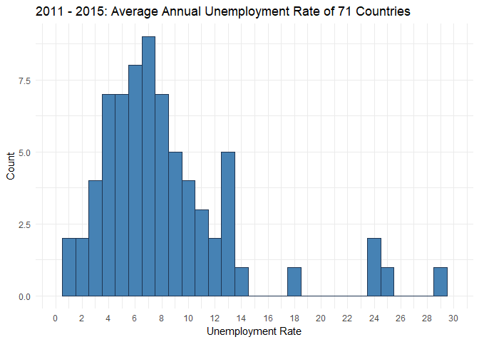
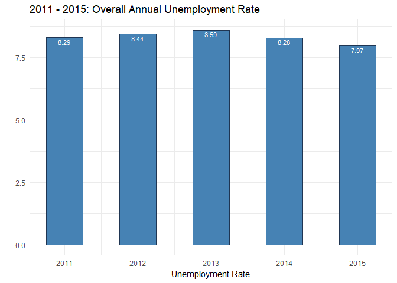

#### Annual Unemployment Rates of 71 Countries from 2011 to 2015

### About the dataset

This dataset was taken from the World Bank Global Economic Monitor. This dataset contains unemployment rates from 88 countries from year 1990 through 2017. 

Source: https://datacatalog.worldbank.org/dataset/global-economic-monitor

### Analysis goals

This analysis will investigate annual unemployment rates from 2011 to 2015 of 71 countries. 

#### Questions

1) For the five year period from 2011 to 2015, what's the average annual unemployment rate of each country?

2) For the five year period from 2011 to 2015, what's the distribution of the average annual unemployment rate? 

3) For the five year period from 2011 to 2015, what's the overall trend of the world's annual unemployment rate? 


### Findings 

The bar graph entitled `2011 - 2015: Average Annual Unemployment Rates` presented on <b>Step 6</b> show the average unemployment rate rankings of the 71 countries. Belarus ranks lowest at 0.65%, and Macedonia ranks highest at 29.09%.

The histogram entitled `2011 - 2015: Average Annual Unemployment Rate of 71 Countries` presented on <b>Step 6</b> shows a distribution that is multimodal and is skewed to the right. Most countries have an average annual unemployment below 14%. The distribution mean is 8.31%. The median is 7.07%. The standard deviation is 5.44%, and the inter quartile range is 4.83%. 

The bar graph entitled `2011-2015: Overall Annual Unemployment Rate` presented under <b>Step 6</b> shows that there was an increasing trend from 2011 to 2013 and a decreasing trend from 2013 to 2015. 2013 ranked highest at 8.44%, and 2015 ranked lowest at 7.97%.


### Load libraries

```r
#rm(list=ls())

library(dplyr)
library(tidyr)
library(knitr)
library(ggplot2)
library(stringr)
library(DT)
```


### Step 1: Load dataset


```r
#fileSource = "C:/Users/stina/Documents/CUNY SPS Data Science/Spring 2018 Classes/DATA 607 - Data Acquisition and Management/Project 2/Unemployment Rate.csv"

fileSource <- "https://raw.githubusercontent.com/Shetura36/Data-607-Assignments/master/Project2/Unemployment%20Rate.csv"

data = read.table(fileSource, header=TRUE, sep=",", na.strings = c("", "NA"))
```

### Step 2:  Investigate data and rename columns

This dataset has 28 observations and 89 variables. The first row is blank. This blank row is going to be removed. The 28 observations excludes this blank row. 

Each row represents data for a specific year for all 88 countries. Each country has its own column name.

The code below will also rename the columns so that ".." or "." characters are replaced with the underscore character (_). R automatically adds dots (.) when there is a space in column names. Also, the year column was automatically assigned the column name "X" since the source file does not have a column name for this. The "X" column name is going to be renamed as `year`.


```r
# 29 observations and 89 variables 
dim(data)
```

```
## [1] 29 89
```

```r
# remove first row
data <- data[-1,]

# rename rownames
rownames(data) <- c(1:28)

# rename first column to "year"
colnames(data)[1] <- "year"

# get column names for countries
column_names <- colnames(data)

# clean up column names for each country
column_names <- 
#replace the ".." with underscore character
  sapply(column_names, stringr::str_replace_all, pattern="[.]{2,2}",replacement= "_") %>% 
  #replace the period at the very end of the string with a blank character
  sapply(stringr::str_replace_all, pattern="[.]{1,1}$",replacement= "") %>% 
  #replace "." with underscore character
  sapply(stringr::str_replace_all, pattern="[.]{1,1}",replacement= "_") %>% 
  sapply(stringr::str_replace_all, pattern="[_]{2,2}",replacement= "_")

#update country column names with cleaner names
colnames(data) <- column_names

#preview data in wide format
#datatable(data) --> does not display on github
kable(head(data[,1:10],10), format="markdown")
```


| year| Argentina| Developing_Asia| Australia|  Austria|  Belgium| Bulgaria| Bahrain| Belarus| Brazil|
|----:|---------:|---------------:|---------:|--------:|--------:|--------:|-------:|-------:|------:|
| 1990|        NA|              NA|  6.943297| 5.373002| 6.550265|       NA|      NA|      NA|     NA|
| 1991|        NA|              NA|  9.614137| 5.823096| 6.439811|       NA|      NA|      NA|     NA|
| 1992|        NA|              NA| 10.750080| 5.941711| 7.088083| 13.23500|      NA|      NA|     NA|
| 1993|        NA|              NA| 10.866170| 6.811381| 8.619116| 15.85583|      NA|      NA|     NA|
| 1994|        NA|              NA|  9.705695| 6.545480| 9.753488| 14.06583|      NA|      NA|     NA|
| 1995|        NA|              NA|  8.471058| 6.589767| 9.673860| 11.38583|      NA|      NA|     NA|
| 1996|        NA|              NA|  8.516425| 7.033851| 9.543726| 11.06167|      NA|      NA|     NA|
| 1997|        NA|              NA|  8.363718| 7.103283| 9.212427| 14.04583|      NA|      NA|     NA|
| 1998|        NA|              NA|  7.651377| 7.184796| 9.338412| 12.20333|      NA|      NA|     NA|
| 1999|        NA|              NA|  6.869885| 6.645249| 8.484549| 13.78250|      NA|      NA|     NA|

### Step 3: Transform wide format into long format

This original table has a year column and followed by columns representing each country. 

I am going to use tidyr to transform all the country columns into a single `country_name` column so that every observation will have the columns `year`, `country_name`, and `annual_unemployment`. 

The `tidyr::gather` function will accomplish this. 

Below you will see a preview of the first few rows of the transformed dataset. 


```r
data <- tidyr::gather(data, "country_name", "annual_unemployment", 2:89)

#preview of tidy dataset (long format)
#datatable(data) --> does not display on Github
kable(head(data, 10), format="markdown")
```


| year|country_name | annual_unemployment|
|----:|:------------|-------------------:|
| 1990|Argentina    |                  NA|
| 1991|Argentina    |                  NA|
| 1992|Argentina    |                  NA|
| 1993|Argentina    |                  NA|
| 1994|Argentina    |                  NA|
| 1995|Argentina    |                  NA|
| 1996|Argentina    |                  NA|
| 1997|Argentina    |                  NA|
| 1998|Argentina    |                  NA|
| 1999|Argentina    |                  NA|

### Step 4: Create a subset

This analysis will only investigate annual unemployment rates from 2012 to 2015. The code below will generate a subset of the data from 2011 to 2015. This five year period was selected because it's the most recent five year period I identified that would exclude the least number of countries with incomplete cases. 

This subset will only include countries with complete cases within the five year period. 

In addition, the following `country_name` entries are going to be excluded since these are groupings of countries and not actual countries. 

* Developing_Asia
* Developing_Countries
* East_Asia_Pacific_developing
* Europe_Central_Asia_developing
* High_Income_Countries
* High_income_OECD
* Latin_America_Caribbean_developing 
* Low_Income
* Middle_Income_Countries
* Middle_East_N_Africa_developing
* High_Income_Non_OECD
* South_Asia_developing
* Sub_Saharan_Africa_developing
* World_WBG_members


```r
#exclude entries that are not countries
exclude_countries = c(
  "Developing_Asia",
  "Developing_Countries",
  "East_Asia_Pacific_developing",
  "Europe_Central_Asia_developing",
  "High_Income_Countries",
  "High_income_OECD",
  "Latin_America_Caribbean_developing",
  "Low_Income",
  "Middle_Income_Countries",
  "Middle_East_N_Africa_developing",
  "High_Income_Non_OECD",
  "South_Asia_developing",
  "Sub_Saharan_Africa_developing",
  "World_WBG_members"
)

#only include years from 2011 to 2015 and exclude countries that are not actual countries
part1 <- 
  data %>%  dplyr::filter(year >= 2011 & year <= 2015) %>% 
    dplyr::filter(!(country_name %in% exclude_countries))

dplyr::filter(data, country_name %in% exclude_countries) %>% dplyr::distinct(country_name)
```

```
##                          country_name
## 1                     Developing_Asia
## 2                Developing_Countries
## 3        East_Asia_Pacific_developing
## 4      Europe_Central_Asia_developing
## 5               High_Income_Countries
## 6                    High_income_OECD
## 7  Latin_America_Caribbean_developing
## 8                          Low_Income
## 9             Middle_Income_Countries
## 10    Middle_East_N_Africa_developing
## 11               High_Income_Non_OECD
## 12              South_Asia_developing
## 13      Sub_Saharan_Africa_developing
## 14                  World_WBG_members
```

```r
#identify countries with missing data
#the code below will count the number of NA values for unemployment_rate for each country
part2 <-
data.frame(part1 %>%  dplyr::filter(year >= 2011 & year <= 2015) %>% 
  dplyr::group_by(country_name) %>% dplyr::summarise(length(which(is.na(annual_unemployment))))) 

#rename column to "NA_count" for readability
colnames(part2) <- c("country_name", "NA_count")

#display countries to be excluded
kable(head(dplyr::filter(part2, NA_count > 0), 10), format="markdown")
```


|country_name | NA_count|
|:------------|--------:|
|Argentina    |        1|
|Israel       |        1|
|Tunisia      |        1|

```r
#identify countries with complete data for 5 year period
part3 <- dplyr::filter(part2, NA_count == 0)

#only include country names with NA_count = 0.
#countries with NA_count of 0 are ones with complete data for years 2011 to 2015. 
target <- 
  part1 %>% dplyr::filter(country_name %in% part3$country_name)

#check number of countries make sense
#total distinct country = 
#excluded coutnries + countries with missing data for 5 year period + countries in target subset
nrow(dplyr::distinct(data,country_name)) ==
  length(exclude_countries) + 
  nrow(dplyr::filter(part2, NA_count > 0)) + 
  nrow(dplyr::distinct(target,country_name))
```

```
## [1] TRUE
```

```r
#number of distinct countries in target subset
nrow(dplyr::distinct(target,country_name))
```

```
## [1] 71
```

```r
#preview target subset
#datatable(target) --> does not display on Github
kable(head(target, 10), format="markdown")
```


| year|country_name | annual_unemployment|
|----:|:------------|-------------------:|
| 2011|Australia    |            5.084754|
| 2012|Australia    |            5.223256|
| 2013|Australia    |            5.661276|
| 2014|Australia    |            6.076739|
| 2015|Australia    |            6.062296|
| 2011|Austria      |            6.724885|
| 2012|Austria      |            6.971840|
| 2013|Austria      |            7.616157|
| 2014|Austria      |            8.368532|
| 2015|Austria      |            9.107860|

### Step 5: Calculate summary data

In this step, we calculate the 5-year average annual_unemployment rate for each country in the target subset.  


```r
target_mean <- 
  data.frame(target %>% dplyr::group_by(country_name) %>% 
               summarise(mean = mean(annual_unemployment)))

#datatable(target_mean) --> does not display on Github
kable(head(target_mean, 10), format="markdown")
```


|country_name |       mean|
|:------------|----------:|
|Algeria      | 10.5200000|
|Australia    |  5.6216642|
|Austria      |  7.7578548|
|Bahrain      |  3.8600000|
|Belarus      |  0.6492506|
|Belgium      |  8.0434458|
|Brazil       |  7.5178434|
|Bulgaria     | 10.6468346|
|Canada       |  7.1483334|
|Chile        |  6.4481292|

### Step 6: Answer questions

#### 1) For the five year period from 2011 to 2015, what's the average annual unemployment rate of each country?

Below is a bar plot of the average annual unemployment rate of 17 countries ordered from lowest to highest. Belarus ranks lowest at about 0.65%. Macedonia ranks highest at about 29.09%. 


```r
target_mean_ordered <- dplyr::arrange(target_mean, mean)

ggplot(data = target_mean_ordered[1:35,], aes(x=reorder(country_name,-mean), y=mean)) + 
  geom_bar(stat="identity", width=0.5, color="#1F3552", fill="steelblue", 
           position=position_dodge()) +
    geom_text(aes(label=round(mean, digits=2)), hjust=1.3, size=3.0, color="white") + 
    coord_flip() + 
    ggtitle("2011 - 2015: Average Annual Unemployment Rates") +
    xlab("") + ylab("Unemployment Rate") + 
    theme_minimal()
```

<!-- -->

```r
ggplot(data = target_mean_ordered[36:71,], aes(x=reorder(country_name,-mean), y=mean)) + 
  geom_bar(stat="identity", width=0.5, color="#1F3552", fill="steelblue", 
           position=position_dodge()) +
    geom_text(aes(label=round(mean, digits=2)), hjust=1.3, size=3.0, color="white") + 
    coord_flip() + 
    ggtitle("2011 - 2015: Average Annual Unemployment Rates (continued)") +
    xlab("") + ylab("Unemployment Rate") + 
    theme_minimal()
```

<!-- -->


#### 2) For the five year period from 2011 to 2015, what's the distribution of the average annual unemployment rate? 

In the histogram below, you will see that the distribution looks multimodal and is skewed to the right. Most countries have an average annual unemployment below 14%. 

The distribution mean is 8.31%. The median is 7.07%. The standard deviation is 5.44%, and the inter quartile range is 4.83%. 


```r
ggplot(target_mean, aes(x = mean)) +
  geom_histogram(aes(y = ..count..), binwidth = 1,colour = "#1F3552", fill = "steelblue") +
  scale_x_continuous(name = "Unemployment Rate",breaks = seq(0, 30, 2), limits=c(0, 30)) +
        scale_y_continuous(name = "Count") +
        ggtitle("2011 - 2015: Average Annual Unemployment Rate of 71 Countries") + 
        theme_minimal()
```

<!-- -->

```r
target_mean %>% dplyr::summarise(dist_mean = mean(mean),
                                 dist_median = median(mean),
                                 dist_sd = sd(mean),
                                 dist_IQR = IQR(mean))
```

```
##   dist_mean dist_median  dist_sd dist_IQR
## 1   8.31395    7.071833 5.439919 4.823871
```

#### 3) For the five year period from 2011 to 2015, what's the overall trend of the world's annual unemployment rate? 

To visualize the overall trend of the world's unemployment rate (as represented by the 71 countries) for each year, a simple average of all of the countries' annual unemployment rates was calculated for each year. 

Below is a bar graph that shows the overall annual unemployment rate for each year. As you can see, 2013 ranked as the highest in overall average unemployment rate at 8.44%, and 2015 ranked lowest at 7.97%. 

Looking at the bar graph below, there was an increasing trend from 2011 to 2013 and a decreasing trend from 2013 to 2015. 


```r
year_mean <- 
  data.frame(target %>% dplyr::group_by(year) %>% summarise(year_mean = mean(annual_unemployment)))

ggplot(data = year_mean, aes(x=year, y=year_mean)) + 
  geom_bar(stat="identity", width=0.5, color="#1F3552", fill="steelblue", 
           position=position_dodge()) +
    geom_text(aes(label=round(year_mean, digits=2)), vjust=1.3, size=3.0, color="white") + 
    ggtitle("2011 - 2015: Overall Annual Unemployment Rate") +
    ylab("") + xlab("Unemployment Rate") + 
    theme_minimal()
```

<!-- -->

